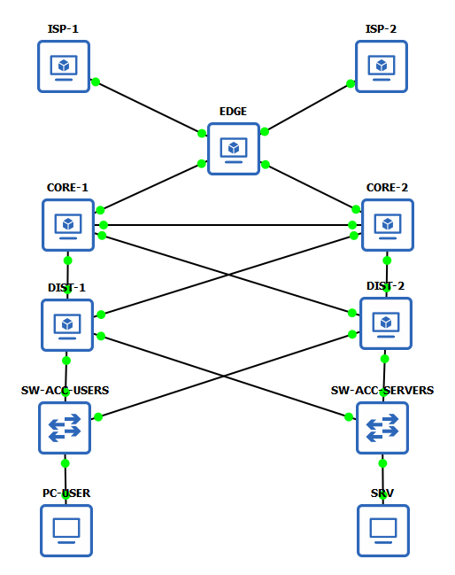
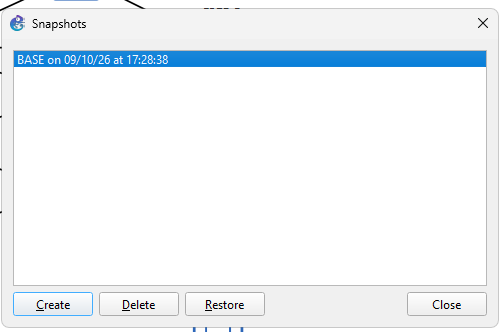

# Memoria del Laboratorio — Failover Routing

**Grupo:** 3

**Materia:** Gestión Operativa y Seguridad en Redes (GOYS)

**Fecha de entrega:** viernes 23/10/2026

## Integrantes y roles

| Integrante | Rol |
|-----------|-----|
| Facundo Daza | R1 (Líder / Edge-WAN) + R2 (Proveedores) + R5 (QA/Ops Fase 1 y 3) |
| Irineo Hiriart | R3 (Core) + R4 (Distribución) + R5 (QA/Ops Fase 2 y 4) |

---

## 1. Diseño (F0)

### 1.1 Corrección del diagrama

| # | Defecto detectado | Corrección aplicada | Justificación |
|:-:|-------------------|---------------------|---------------|
| 1 | Subredes solapadas en la capa de acceso. | Se asignó `192.168.10.0/24` para usuarios y `192.168.20.0/24` para servidores. | Previene asimetría de enrutamiento y permite la sumarización correcta de rutas en OSPF. |
| 2 | Ausencia de enlace core-core. | Se agregó un enlace directo L3 (10.0.0.8/30) entre CORE-1 y CORE-2. | Evita la partición del backbone (área 0) y el descarte de tráfico ante la caída de enlaces cruzados. |
| 3 | HSRP mal ubicado en el Core. | Se desplazó la redundancia de gateway (VRRP) a los switches DIST-1 y DIST-2. | Libera al Core para dedicarse exclusivamente al tránsito rápido de paquetes, ubicando las políticas L3 en Distribución. |

### 1.2 Plan de direccionamiento (IPAM)

| Enlace / Red | Subred | Dispositivo A (IP/iface) | Dispositivo B (IP/iface) |
|--------------|:------:|--------------------------|--------------------------|
| ISP-1 ↔ EDGE | `203.0.113.0/30` | ISP-1 (203.0.113.1 - 0/0) | EDGE (203.0.113.2 - 0/0) |
| ISP-2 ↔ EDGE | `198.51.100.0/30`| ISP-2 (198.51.100.1 - 0/0) | EDGE (198.51.100.2 - 1/0) |
| EDGE ↔ CORE-1 | `10.0.0.0/30` | EDGE (10.0.0.1 - 2/0) | CORE-1 (10.0.0.2 - 0/0) |
| EDGE ↔ CORE-2 | `10.0.0.4/30` | EDGE (10.0.0.5 - 3/0) | CORE-2 (10.0.0.6 - 0/0) |
| CORE-1 ↔ CORE-2 (core-core) | `10.0.0.8/30` | CORE-1 (10.0.0.9 - 1/0) | CORE-2 (10.0.0.10 - 1/0) |
| CORE ↔ DIST-1 (×2) | `10.0.0.12/30` `10.0.0.20/30` | CORE-1 (10.0.0.13 - 2/0) CORE-2 (10.0.0.21 - 2/0) | DIST-1 (10.0.0.14 - 0/0) DIST-1 (10.0.0.22 - 1/0) |
| CORE ↔ DIST-2 (×2) | `10.0.0.16/30` `10.0.0.24/30` | CORE-1 (10.0.0.17 - 3/0) CORE-2 (10.0.0.25 - 3/0) | DIST-2 (10.0.0.18 - 0/0) DIST-2 (10.0.0.26 - 1/0) |
| USERS (gateway VRRP) | `192.168.10.0/24`| DIST-1 (192.168.10.2 - 2/0) | DIST-2 (192.168.10.3 - 2/0) |
| SERVERS (gateway VRRP) | `192.168.20.0/24`| DIST-1 (192.168.20.2 - 3/0) | DIST-2 (192.168.20.3 - 3/0) |

**VRRP:**

| Grupo | VRID | Master | Priority | IP virtual |
|-------|:----:|:------:|:--------:|:----------:|
| USERS | 10 | DIST-1 | 150 | `192.168.10.1` |
| SERVERS | 20 | DIST-2 | 150 | `192.168.20.1` |

**Router-IDs:** 
- EDGE: `1.1.1.1`
- CORE-1: `4.4.4.4`
- CORE-2: `5.5.5.5`
- DIST-1: `6.6.6.6`
- DIST-2: `7.7.7.7`

### 1.3 Política de seguridad

- **Usuarios y privilegios:** Usuario `admin` deshabilitado. Creación de `netadmin` (full) para configuración y `monitor` (read) para verificación.
- **Servicios que se deshabilitan:** Telnet, FTP, WWW, API, MAC-Telnet, MAC-Ping. 

- Gestión permitida: La administración de los equipos se realizará a través de la Consola local del simulador GNS3 y mediante winbox (interfaz gráfica de MikroTik) habilitado en su puerto seguro por defecto.
- **Claves de autenticación** (OSPF / BGP / VRRP): 
  - OSPF: `OspfGoys26!`
  - BGP: `BgpGoys26!`
  - VRRP: `VrrpGoys26!`

### 1.4 Política de operación

- **Formato del change log** (convención de commits): Uso estricto de Conventional Commits (`tipo(alcance): descripción`). Cada cambio debe vincularse a un rol.
- **Política de backup** (cuándo y cómo): Ejecución de `/export file=backup-<nodo>-<fecha>.rsc` e inclusión en el directorio `/backups` del repositorio tras la estabilización de cada Epic (F1, F2, F3).

---

## 2. Topología

Se implementó en GNS3 una topología de cinco capas: Internet,
Edge, Core, Distribución y Acceso. Está compuesta por siete
routers MikroTik CHR con RouterOS 7.16, dos switches Ethernet
y dos hosts VPCS, conectados mediante 15 enlaces.

Cada switch de acceso conecta su host con ambos routers de
distribución. USERS y SERVERS constituyen segmentos separados.
Se incorporó el enlace L3 directo entre CORE-1 y CORE-2.

---

## 3. Configuración

### 3.1 Configuración base — F1

Se configuraron las identidades, las direcciones de los enlaces
/30, las direcciones reales de distribución en las LAN y las
loopbacks /32 sobre la interfaz lo.

| Router | Loopback |
|---|---|
| EDGE | 1.1.1.1/32 |
| ISP-1 | 2.2.2.2/32 |
| ISP-2 | 3.3.3.3/32 |
| CORE-1 | 4.4.4.4/32 |
| CORE-2 | 5.5.5.5/32 |
| DIST-1 | 6.6.6.6/32 |
| DIST-2 | 7.7.7.7/32 |

PC-USER tiene 192.168.10.100/24 y gateway 192.168.10.1.
SRV tiene 192.168.20.100/24 y gateway 192.168.20.1.

Los gateways virtuales quedan reservados para VRRP en F2.
Los clientes DHCP preconfigurados en ether1 fueron deshabilitados.

Las configuraciones de OSPF, VRRP y BGP quedan pendientes para
F2 y F3. Los exports de la configuración base están en backups/.

---

## 4. Verificación

### 4.1 Verificación de F1

Se verificó conectividad mediante ping en los nueve enlaces
directos entre routers. También se comprobó que PC-USER alcanza
192.168.10.2 y 192.168.10.3, y que SRV alcanza 192.168.20.2
y 192.168.20.3.

Las pruebas se realizaron nuevamente después del hardening,
con resultados satisfactorios. Las evidencias se encuentran
en capturas/F1/.

La conectividad entre redes y los simulacros de failover quedan
pendientes para las fases posteriores.

---

## 5. Seguridad aplicada

### 5.1 Hardening de F1

En los siete routers se creó netadmin con grupo full y monitor
con un grupo personalizado denominado monitoring, cuyos
permisos son local, read y winbox. Se deshabilitó el usuario admin.

Se deshabilitaron Telnet, FTP, HTTP, HTTPS, SSH, API y API-SSL.
Winbox por IP quedó habilitado. También se deshabilitaron
MAC-Telnet, MAC-Winbox y MAC-Ping.

En los ISP se conservaron activas únicamente las interfaces
ether1. En EDGE, CORE y DIST se conservaron ether1 a ether4,
deshabilitando las interfaces Ethernet restantes.

Se verificaron usuarios, permisos, servicios e interfaces en
los siete routers. El ingreso con monitor y la consulta de
direcciones se probaron en ISP-1.

La autenticación de los protocolos de enrutamiento y el
firewall de EDGE quedan pendientes para las fases posteriores.

---

## 6. Gestión operativa

### 6.1 Change log

> *Nota: El registro de cambios se completará progresivamente, reflejando el historial estructurado de commits del repositorio Git a lo largo de las fases F1 a F5.*

### 6.2 Backups

Se generaron y guardaron en backups/ los siete exports de F1,
con nombres backup-<nodo>-2026-10-09.rsc.

Estos exports contienen la configuración textual exportable.
Los archivos obtenidos no incluyen los usuarios netadmin y
monitor, sus contraseñas ni la deshabilitación de admin; esos
elementos deben reponerse al restaurar desde los exports.

Se creó en GNS3 el snapshot BASE con los nodos detenidos,
después de configurar y verificar direccionamiento y hardening.
El snapshot conserva el estado base del proyecto.

La prueba de restauración queda pendiente.

### 6.3 Monitoreo

> *Nota: La configuración y los resultados del monitoreo continuo (SNMP y chequeos de estado) se incluirán durante la ejecución de la Fase F4.*

---

## 7. Capturas

> *Nota: El directorio y los enlaces a las evidencias visuales de los estados del sistema, tablas de enrutamiento y simulacros se integrarán en las fases operativas correspondientes.*

---

## 8. Conclusiones y lecciones aprendidas

> *Nota: El análisis post-mortem global y las conclusiones técnicas sobre la resiliencia de la arquitectura diseñada se redactarán al concluir la Fase F5.*

---

## 9. Referencias

- Documentación oficial de MikroTik RouterOS (VRRP, OSPF, BGP).
- RFC 5798 (Virtual Router Redundancy Protocol).
- RFC 2328 (OSPF Version 2).
- Diapositivas y material de cátedra: "Failover Routing".

---

## 10. Checklist de entrega

### Diseño (F0)
- [x] IPAM completo y sin solapamiento
- [x] Corrección del diagrama justificada (≥ 3 defectos)
- [x] Política de seguridad definida (usuarios, servicios, claves)
- [x] Política de operación definida (change log + backup)

### Redes
- [ ] 7 CHR + 2 switches + 2 hosts levantados y cableados
- [ ] VRRP operativo (2 grupos, load-sharing)
- [ ] OSPF área 0 con adyacencias (incluido core–core)
- [ ] BGP eBGP ×2 establecido (multi-homing)
- [ ] Los 5 drills ejecutados y documentados (runbook + post-mortem + tiempo)

### Seguridad
- [ ] Hardening aplicado (password, usuario mínimo, servicios apagados)
- [ ] OSPF MD5 funcionando
- [ ] BGP TCP-MD5 funcionando
- [ ] VRRP auth funcionando
- [ ] Firewall edge aplicado
- [ ] Prueba con clave incorrecta → debe **fallar** (documentado)

### Operación
- [ ] Change log completo (refleja los commits del repo)
- [ ] Backups con restore probado
- [ ] Monitoreo habilitado y documentado
- [ ] Runbook por drill + post-mortem global

### Entrega
- [ ] Memoria completa (todas las secciones de esta plantilla)
- [ ] Repo git con la estructura correcta y commits por rol
- [ ] `backlog.md` con todas las tareas en "done"
- [ ] Capturas en la carpeta `capturas/`
- [ ] Cada integrante puede defender su parte **y** una parte ajena